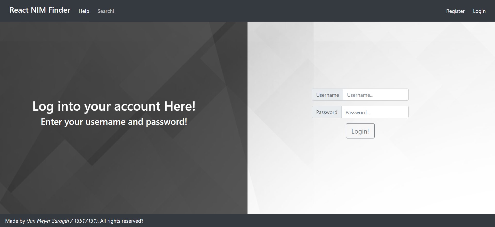

<h1 align = "center">
  README React NIM Finder
</h1>

### Merupakan aplikasi pencari NIM mahasiswa yang memanfaatkan React untuk melakukan API Call ke _https://api.satya.net_

## Informasi Aplikasi

### NIM : 13517131

### Nama Pembuat : Jan Meyer Saragih

### Nama Aplikasi : React NIM Finder

## Cara Instalasi

### Instalasi React

- Install npm dari internet (source: _https://www.npmjs.com/package/download_)
- Install React dengan menggunakan npm, yaitu dengan mengetikkan _npm install react_
- Gunakan command line untuk membuka folder di mana aplikasi ingin dibuat
- Install semua package yang pernah diinstall dengan menggunakan _npm run install_

### Setelah melakukan instalasi React, maka Anda dapat melakukan:

1. Menjalankan aplikasi dalam komputer sendiri dengan menggunakan _npm start_
2. Melakukan build aplikasi ini dan membukanya pada website

#### Untuk opsi <1>

- Ketik _npm start_ pada cmd
- Buka _localhost:3000_ pada browser untuk mengakses hasil dari _npm start_

#### Untuk opsi <2>

- Ketik _npm run build_ untuk membuat folder build hasil pembuatan aplikasi tersebut
- Folder _build_ akan tersedia pada folder ini yang menandakan hasil build dari aplikasi ini

## Cara Menggunakan Aplikasi

### Tampilan Page pada Aplikasi

##### Home Page

 

##### Help Page

 

##### Login Page

 

##### Register Page

 

##### Search Page

 

### Langkah penggunaan aplikasi

- Pada saat Anda pertama kali membuka aplikasi ini, Anda akan membuka _Home Page_ yang hanya berisi title beserta navigation bar sebagai header dan footernya.
- Pada navigation bar di atas, terdapat laman yang bisa diakses, yaitu _Help_, _Login_, dan _Register_.
- Laman _Help_ berisi penjelasan mengenai fitur yang terdapat dalam aplikasi ini. Namun, sebagian dari isinya hanya bercanda.
- Laman _Register_ memungkinkan pengguna untuk melakukan registrasi. Dengan memasukkan username dan password yang dibutuhkan untuk user tersebut, aplikasi akan melakukan HTTP POST ke API yang disediakan. Jika sukses, maka akan dikembalikan kode 0 dan username beserta password tersebut telah terdaftar dalam API tersebut untuk 1 hari.
- Laman _Login_ digunakan agar Anda dapat memperoleh akses untuk melakukan searching NIM pada aplikasi ini. Setelah melakukan register, maka Anda dapat memasukkan username dan password yang telah di-register dan memperoleh akses dalam aplikasi ini.
- Setelah Anda login, maka terdapat 2 fungsi lagi yang dapat dimanfaatkan yaitu _Search_ dan _Logout_
- Laman _Search_ merupakan laman utama yang memungkinkan Anda untuk mencari detail mengenai nama dan NIM dari seseorang yang terdaftar dalam database dengan melakukan HTTP GET ke API yang disediakan. Jika sukses, maka akan ditampilkan tabel yang berisi informsai detail mengenai setiap mahasiswa yang memenuhi kriteria tersebut.
- Fungsi _Logout_ merupakan fungsi, bukan laman, yang mengembalikan Anda ke laman utama dan menghapus token yang Anda dapat pada saat Anda melakukan login. Dengan demikian, _Search_ dan _Logout_ tidak dapat digunakan lagi sampai Anda melakukan _Login_.

## Desain Aplikasi

### Susunan class yang dibuat

Class-class javascript yang dibuat menggambarkan bagaimana aplikasi React ini akan digunakan. Pertama pada saat melakukan rendering aplikasi ini, index.js dibuka dan akan memanggil render pada App.js setelah menyiapkan domain dengan menggunakan React-DOM. Setelah memanggil App.js, terdapat beberapa class yang dipanggil oleh App.js, yaitu:

- NavigationBar.js -> Hasil rendernya merupakan bagian dari hasil render App.js yang berfungsi untuk merender NavigationBar yang terdapat di atas. NavigationBar di atas juga berfungsi sebagai interface agar user dapat berpindah dari satu laman ke laman lain dengan melakukan click pada salah satu button ang aktif.
- Title.js -> Merupakan basa-basi dari homepage. Title.js hanya berisi teks untuk judul dan wrappernya. Hasil render dari class ini dapat ditampilkan pada App.js bila perlu.
- Help.js -> Merupakan basa-basi yang berisi penjelasan dari fitur-fitur yang terdapat dalam aplikasi ini. Hasil render dari class ini juga dapat ditampilkan pada App.js bila diperlukan.
- Login.js -> Merupakan interface untuk melakukan login pada sebuah aplikasi. Class ini melakukan render laman login untuk ditampilkan pada App.js bila perlu. Class ini juga memanfaatkan hasil render dari LoginForm.js berupa form yang berisi data yang dibutuhkan untuk login.
- Register.js -> Merupakan interface untuk melakukan register pada sebuah aplikasi. Class ini melakukan render laman register yang nantinya akan ditampilkan pada App.js. Class ini juga memanfaatkan hasil render dari RegisterForm.js berupa form berisi data yang akan didaftarkan dengan melakukan HTTP POST pada API yang disediakan.
- Search.js -> Merupakan laman inti, yang juga dapat digunakan di App.js. Laman ini memanfaatkan SearchForm.js yang digunakan untuk mendapatkan query pencarian. Setelah mendapatkan query pencarian, Search.js menentukan apakah input tersebut semuanya berupa angka. Jika ya, maka dilakukan pencarian berdasarkan NIM. Jika tidak, maka dilakukan pencarian berdasarkan nama.

#### Design Pattern Decorator

Design Pattern Decorator digunakan pada pembuatan aplikasi ini. Struktur yang dibuat merupakan struktur decorator. Struktur pada design pattern ini digunakan, yaitu dengan menggunakan App.js sebagai parent dan class-class lainnya merupakan "anak" dari class App.js. Hal ini disebabkan hanya class App.js yang dirender oleh komputer. Sementara itu, class yang lainnya dirender dan hasilnya diberikan kepada App.js untuk dijadikan sebuah hasil render yang utuh.

#### Design Pattern Chain of Responsibility

Design Pattern Chain of Responsibility digunakan pada pembuatan aplikasi ini. Behavioral ini digunakan dengan memberikan "tanggung jawab" kepada class lain untuk merender bagian dari class yang memberikannya. Dalam hal ini, class App.js memberikan perintah kepada class-class "anaknya" untuk merender bagian yang diperlukan untuk dikembalikan sebagai suatu hasil render yang utuh. 

## Library

#### Terdapat 3 buah library yang digunakan untuk melakukan projek ini, yaitu

- React: Merupakan library dasar yang memang dibutuhkan untuk membuat aplikasi React
- React-DOM: Merupakan library yang dibutuhkan untuk membuat sebuah domain yang memanfaatkan aplikasi React.
- Bootstrap: Merupakan library yang dibutuhkan untuk melakukan styling pada page yang digunakan (selain menggunakan css).

#### Link dari library tersebut adalah:

- 
- 
- 

## Saran terhadap API

API yang dibuat sudah bagus. Untuk pemula seperti saya, API yang diberikan mudah untuk dipahami dan mampu dijadikan sebagai bahan untuk mempelajari API call, namun masih terdapat masalah yang dimiliki oleh API tersebut, yaitu sebagai berikut:

- API memberikan token yang mudah di-copy pada saat login sehingga user lain mampu berbagi token tersebut. Token tersebut memiliki waktu expire 1 hari dan itu merupakan waktu yang lama bagi attacker untuk memanfaatkan cookie untuk menyerang API tersebut.
- API tidak memberikan jumlah tuple yang memenuhi pencarian query. Dengan demikian, tidak dapat ditentukan jumlah page yang dibutuhkan untuk sebuah query sebelum melakukan searching secara keseluruhan.
